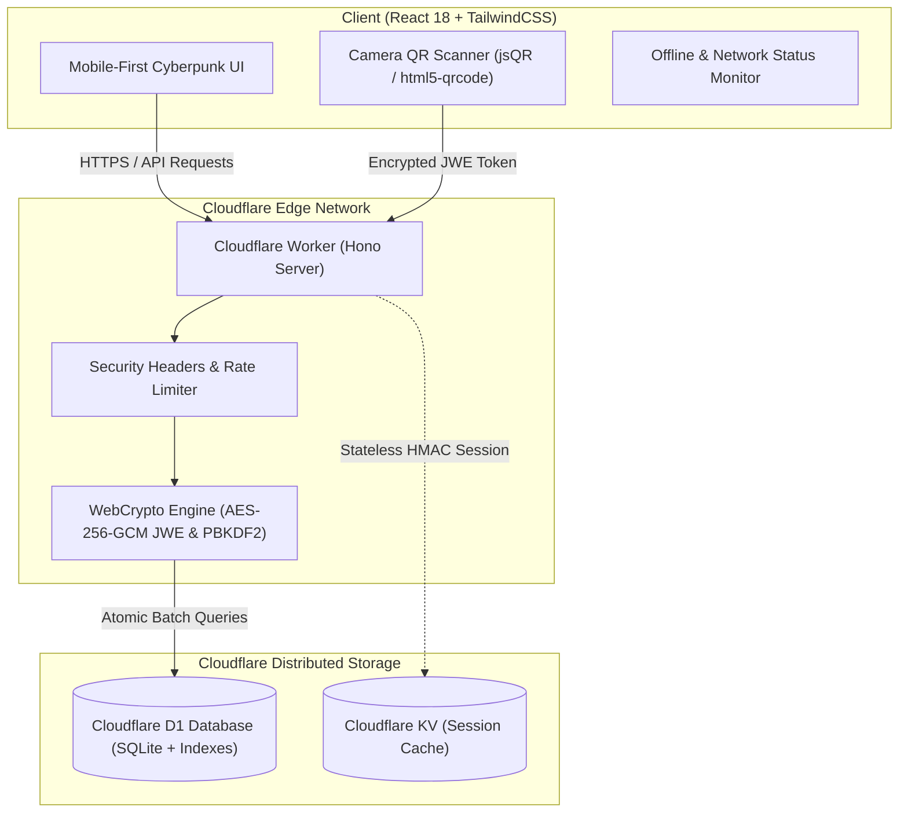

# AMS — Attendance Management System

<div align="center">


**Sistem Manajemen Presensi & Kegiatan Modern Berbasis QR Code Terenkripsi AES-256-GCM JWE untuk Komunitas Komputer (Computer Community).**

[Fitur Utama](#-fitur-utama) • [Arsitektur](#-arsitektur--diagram-sistem) • [Panduan Instalasi](#-panduan-instalasi-lokal) • [Deployment Cloudflare](#-panduan-deployment-ke-cloudflare) • [Keamanan](#-audit-keamanan--keandalan)

</div>

---

## 📖 Tentang AMS

**AMS (Attendance Management System)** adalah platform pencatatan dan pengelolaan presensi berskala *enterprise* yang dirancang khusus untuk memenuhi kebutuhan kegiatan, seminar, *workshop*, dan keanggotaan organisasi. Dibangun di atas infrastruktur serverless **Cloudflare Workers** dan database **Cloudflare D1 (SQLite)**, AMS memberikan kecepatan respon instan (*edge computing*), efisiensi biaya tinggi (*Zero Cold Start*), serta keamanan kriptografis standar industri.

---

## 🚀 Fitur Utama

### 1. 📷 Pemindai QR Cepat & Multi-Station
- Mendukung pemindaian langsung dari kamera *smartphone*, tablet, maupun webcam laptop.
- Pengenalan QR instan dengan *audio chime*, *haptic feedback*, dan *live scan toast*.
- Tipe sesi fleksibel: `CHECKIN`, `CHECKOUT`, `BREAK_OUT`, `BREAK_IN`, hingga akses panggung/sesi khusus.
- Proteksi *double-scan* konkuren dan pencegahan pemalsuan tiket menggunakan dekripsi **AES-256-GCM JWE Compact Token**.

### 2. 🎟️ Tiket Tamu Sementara & Fitur Promosi Instan (*Guest Promotion*)
- Fasilitas penerbitan tiket tamu (*guest pass*) langsung di lokasi kegiatan tanpa repot mengisi formulir pendaftaran panjang.
- **Promosi Anggota Resmi:** Mengubah tamu/peserta sementara menjadi anggota tetap dalam 1 kali klik dengan seluruh riwayat kehadiran kegiatan pertama langsung tersinkronisasi.
- Opsi pembersihan otomatis (*cleanup guests*) untuk merapikan database setelah kegiatan selesai.

### 3. 📊 Dashboard Analitik Interaktif
- **Grafik Donut Interaktif SVG:** Visualisasi persentase dan peringkat **Top 10 Kegiatan** dengan peserta terbanyak lengkap dengan *inner scroll container*.
- **Navigasi Langsung:** Klik pada bagian donat atau kartu peringkat untuk langsung membuka detail absensi kegiatan terkait.
- **Statistik Anggota & Kehadiran:** Filter dinamis status aktif/nonaktif dan pemantauan kegiatan yang sedang berlangsung dengan tombol *Quick Scan*.

### 4. 🏆 Member Activity Tracker & Tiering Dinamis
- Melacak tingkat keaktifan anggota berdasarkan akumulasi presensi kegiatan:
  - 🥇 **Platinum**: $\ge 8$ Kehadiran
  - 🥈 **Gold**: $5 - 7$ Kehadiran
  - 🥉 **Silver**: $2 - 4$ Kehadiran
  - 🎖️ **Bronze**: $1$ Kehadiran
  - ⚪ **Inactive / New**: $0$ Kehadiran
- Seluruh tamu otomatis difilter keluar dari leaderboard keaktifan agar data peringkat tetap valid untuk anggota resmi.

### 5. 👥 Manajemen Tim & Autentikasi Admin Berbasis QR
- Role-Based Access Control (RBAC): `owner`, `admin`, `operator`, dan `auditor`.
- Pengangkatan admin langsung dari profil anggota aktif.
- **Login Menggunakan QR Anggota:** Operator dapat login ke dashboard sistem hanya dengan memindai QR anggota pribadinya tanpa perlu mengetik password.

### 6. ⚡ Multi-Select Batch Actions & Cetak ID Badge
- Fitur multi-select pada seluruh daftar data (Anggota, Kegiatan, Absensi).
- Floating Action Bar responsif: Cetak QR massal, ekspor CSV massal, promosi massal, dan hapus massal dalam sekali klik.

### 7. 🌐 Ketahanan Jaringan & Offline Connectivity Status
- Pendeteksi status internet (`navigator.onLine`) dengan floating banner real-time saat sinyal terputus.
- Mekanisme **Timeout 15 Detik** dan **Auto-Retry** otomatis untuk mencegah antarmuka menggantung saat berada di area dengan sinyal lemah.

---

## 🏛️ Arsitektur & Diagram Sistem



---

## 🛠️ Tech Stack

| Lapisan | Teknologi |
| :--- | :--- |
| **Frontend Framework** | React 18, TypeScript, TailwindCSS, Lucide Icons |
| **QR Scanning Engine** | jsQR, html5-qrcode, qrcode.react |
| **Backend Runtime** | Cloudflare Workers (workerd engine), Hono Framework |
| **Database** | Cloudflare D1 (Serverless SQLite dengan Composite Indexes) |
| **Kriptografi** | WebCrypto API (AES-256-GCM, HMAC-SHA256, PBKDF2 30k iters) |
| **Validasi Skema** | Zod v3 |
| **Testing** | Vitest (14 Test Suites, 67 Unit Tests passed) |

---

## 💻 Panduan Instalasi Lokal

### 1. Prasyarat
- [Node.js](https://nodejs.org/) v18 atau lebih baru.
- npm / pnpm / yarn.

### 2. Kloning Repositori & Pasang Dependensi
```bash
git clone https://github.com/your-username/ams.git
cd ams
npm install
```

### 3. Konfigurasi Environment Lokal
Salin template konfigurasi lokal:
```bash
cp .dev.vars.example .dev.vars
```

### 4. Inisialisasi Database Lokal
Terapkan migrasi skema database SQLite D1 secara lokal:
```bash
npm run db:init:local
```

### 5. Jalankan Server Pengembangan
Jalankan server backend Cloudflare Worker dan antarmuka client:
```bash
# Terminal 1: Backend Worker (Port 8787)
npm run dev:worker

# Terminal 2: Frontend Vite Client (Port 5173)
npm run dev
```
Buka browser di `http://localhost:5173`. Akun Default Owner akan otomatis diinisialisasi pada peluncuran pertama.

---

## ☁️ Panduan Deployment ke Cloudflare

### 1. Autentikasi Akun Cloudflare ke Wrangler

Terdapat dua cara untuk menghubungkan akun Cloudflare Anda ke Wrangler:

#### A. Metode 1: Login Interaktif Web (OAuth) — Direkomendasikan untuk Komputer Lokal
Jalankan perintah login di terminal:
```bash
npx wrangler login
```
Browser akan otomatis terbuka. Klik tombol **Allow** untuk memberikan izin akses Wrangler ke akun Cloudflare Anda.

#### B. Metode 2: API Token (Non-Interaktif / Server / CI/CD)
Jika Anda menggunakan server VPS, Docker, atau GitHub Actions:
1. Buka [Cloudflare Dashboard > My Profile > API Tokens](https://dash.cloudflare.com/profile/api-tokens).
2. Klik **Create Token** > pilih template **Edit Cloudflare Workers** (atau buat *Custom Token*).
3. Pastikan token memiliki izin (*permissions*) minimal:
   - `Account` > `Cloudflare D1` > `Edit`
   - `Account` > `Workers KV Storage` > `Edit`
   - `Account` > `Workers Scripts` > `Edit`
   - `Account` > `Account Settings` > `Read`
   - `User` > `Memberships` > `Read`
4. Set variabel environment di terminal Anda:
   ```bash
   export CLOUDFLARE_API_TOKEN="api-token-rahasia-anda"
   export CLOUDFLARE_ACCOUNT_ID="account-id-anda"
   ```

#### C. Verifikasi Status Autentikasi
Periksa apakah Wrangler sudah berhasil terhubung:
```bash
npx wrangler whoami
```
Perintah ini akan menampilkan email akun, nama akun, dan Account ID Anda.

---

### 2. Konfigurasi Database D1 & KV Remote

#### A. Buat Database Cloudflare D1
```bash
npx wrangler d1 create ams-db
```
Catat output `database_id` yang diberikan, lalu perbarui nilai `database_id` di file `wrangler.toml`:
```toml
[[d1_databases]]
binding = "DB"
database_name = "ams-db"
database_id = "paste-database-id-anda-disini"
```

#### B. Terapkan Migrasi Skema ke Database Remote
Jalankan migrasi seluruh tabel dan indeks ke server Cloudflare D1:
```bash
npm run db:migrate:remote
```

---

### 3. Konfigurasi Kunci Rahasia Produksi (Secrets)

Simpan variabel keamanan terenkripsi pada Cloudflare Workers:
```bash
# Set kunci enkripsi QR JWE AES-256-GCM (32-byte base64)
npx wrangler secret put QR_KEY_K1

# Set secret token sesi HMAC
npx wrangler secret put SESSION_SECRET
```

---

### 4. Build & Deploy dalam Satu Perintah

Jalankan perintah deployment terintegrasi:
```bash
npm run deploy
```
*Perintah di atas akan otomatis mengompilasi aset frontend Vite (`npm run build`) dan mempublikasikan Worker beserta static assets ke Cloudflare global network.*

URL produksi aplikasi Anda (misal: `https://ams.<subdomain>.workers.dev`) akan langsung ditampilkan di terminal.

---

## 🔒 Audit Keamanan & Keandalan

AMS telah melalui audit menyeluruh dan hardening enterprise-grade:

1. **Perlindungan CSV Formula Injection (CWE-1236):** Sanitasi otomatis (`sanitizeCsvCell`) pada fitur ekspor absensi dan data anggota guna mengamankan karakter pemicu formula (`=`, `+`, `-`, `@`, `\t`, `\r`) saat file dibuka di Microsoft Excel / Google Sheets.
2. **Security Headers Lengkap:** Injeksi `X-Content-Type-Options: nosniff`, `X-Frame-Options: DENY`, `Referrer-Policy: strict-origin-when-cross-origin`, dan `Permissions-Policy: camera=(self)`.
3. **Anti-Timing Attack:** Menggunakan perbandingan string konstan (*constant-time comparison*) `timingSafeEqualStrings` untuk verifikasi hash password dan token.
4. **Anti-Brute Force Rate Limiter:** Pembatasan percobaan login (10 percobaan gagal / 15 menit) berbasis *in-memory sliding window* tanpa membebani kuota D1/KV.
5. **Mitigasi Limit Free Tier Cloudflare:**
   - Stateless HMAC-SHA256 session token (**0 KV Writes** harian).
   - 10 Composite Indexes pada D1 untuk mengeliminasi *Full Table Scans* (aman dari batas 5.000.000 Rows Read/hari).
   - Utility `chunkArray` mencegah pelanggaran batas maksimal 100 bound parameters per query pada D1.
   - Optimasi CPU PBKDF2 ke 30.000 iterasi (~2.5ms CPU time, aman dari limit 10ms CPU Workers).

---

## 🧪 Pengujian Unit

Seluruh fungsi kriptografi, repository database, skema validasi, dan API client diuji menggunakan **Vitest**:

```bash
npm test
```
Hasil pengujian: **14 Test Suites (67/67 Tests Passed)**.

---

## 📜 Lisensi & Kontribusi

Dikembangkan dengan bangga untuk **Computer Community**. Dilisensikan di bawah [MIT License](LICENSE).
