# AMS — Attendance Management System

<div align="center">


**Sistem Manajemen Presensi & Kegiatan Modern Berbasis QR Code Terenkripsi AES-256-GCM JWE untuk Komunitas Komputer (Computer Community).**

[Fitur Utama](#-fitur-utama) • [Arsitektur](#-arsitektur--diagram-sistem) • [Panduan Instalasi](#-panduan-instalasi-lokal) • [Deployment Cloudflare](#-panduan-deployment-ke-cloudflare) • [Keamanan & Optimasi](#-audit-keamanan--optimasi-performa) • [Pengujian](#-pengujian-unit--integrasi)

</div>

---

## 📖 Tentang AMS

**AMS (Attendance Management System)** adalah platform pencatatan dan pengelolaan presensi berskala *enterprise* yang dirancang khusus untuk memenuhi kebutuhan kegiatan, seminar, *workshop*, dan keanggotaan organisasi. Dibangun di atas infrastruktur serverless **Cloudflare Workers**, database **Cloudflare D1 (SQLite)**, dan **Cloudflare KV**, AMS memberikan kecepatan respon instan (*edge computing*), efisiensi biaya tinggi (*Zero Cold Start*), serta keamanan kriptografis standar industri.

---

## 🚀 Fitur Utama

### 1. 📷 Pemindai QR Cepat & Multi-Station
- Mendukung pemindaian langsung dari kamera *smartphone*, tablet, maupun webcam laptop.
- Pengenalan QR instan dengan *audio chime*, *haptic feedback*, dan *live scan toast*.
- Tipe sesi fleksibel: `CHECKIN`, `CHECKOUT`, `BREAK_OUT`, `BREAK_IN`, hingga akses panggung/sesi khusus.
- Proteksi *double-scan* konkuren dan pencegahan pemalsuan tiket menggunakan dekripsi **AES-256-GCM JWE Compact Token**.

### 2. ⚡ 2-Tier Caching & Skeleton Shimmer UI (Ultra Responsif)
- **Tier 1: SWR Client-Side Memory Cache (0ms):** Memuat data tabel anggota, kegiatan, dan leaderboard keaktifan secara instan saat navigasi antar tab tanpa jeda *loading* berulang.
- **Tier 2: Cloudflare Edge Cache API (`caches.default`):** Caching global di jaringan CDN Cloudflare dengan **Granular Tag Invalidation** (perubahan data kegiatan hanya menghapus cache `agenda`, tanpa mengganggu cache `members`).
- **Skeleton Shimmer UI:** Placeholder visual kartu dan tabel yang elegan saat pemanggilan data awal guna mengeliminasi lonjakan visual (*layout shift / empty jump*).

### 3. 🎟️ Tiket Tamu Sementara & Promosi Instan (*Guest Promotion*)
- Fasilitas penerbitan tiket tamu (*guest pass*) langsung di lokasi kegiatan tanpa repot mengisi formulir pendaftaran panjang.
- **Promosi Anggota Resmi:** Mengubah tamu/peserta sementara menjadi anggota tetap dalam 1 kali klik dengan seluruh riwayat kehadiran kegiatan pertama langsung tersinkronisasi.
- Opsi pembersihan otomatis (*cleanup guests*) untuk merapikan database setelah kegiatan selesai.

### 4. 📊 Dashboard Analitik Interaktif
- **Grafik Donut Interaktif SVG:** Visualisasi persentase dan peringkat **Top 10 Kegiatan** dengan peserta terbanyak lengkap dengan *inner scroll container*.
- **Grafik Pertumbuhan Anggota Tahunan:** Visualisasi kohort angkatan anggota per tahun dengan filter dinamis anggota aktif/seluruhnya.
- **Navigasi Langsung:** Klik pada bagian donat atau kartu peringkat untuk langsung membuka detail absensi kegiatan terkait.

### 5. 🏆 Member Activity Tracker & Tiering Dinamis
- Melacak tingkat keaktifan anggota berdasarkan akumulasi presensi kegiatan:
  - 🥇 **Platinum**: $\ge 8$ Kehadiran
  - 🥈 **Gold**: $5 - 7$ Kehadiran
  - 🥉 **Silver**: $2 - 4$ Kehadiran
  - 🎖️ **Bronze**: $1$ Kehadiran
  - ⚪ **Inactive / New**: $0$ Kehadiran
- Seluruh tamu otomatis difilter keluar dari leaderboard keaktifan agar data peringkat tetap valid untuk anggota resmi.

### 6. 👥 Manajemen Tim & Autentikasi Admin Berbasis QR
- Role-Based Access Control (RBAC): `owner`, `admin`, `operator`, dan `auditor`.
- Pengangkatan admin langsung dari profil anggota aktif.
- **Login Menggunakan QR Anggota:** Operator dapat login ke dashboard sistem hanya dengan memindai QR anggota pribadinya tanpa perlu mengetik password.

### 7. ⚡ Multi-Select Batch Actions & Cetak ID Badge A4/PDF
- Fitur multi-select pada seluruh daftar data (Anggota, Kegiatan, Absensi).
- Floating Action Bar responsif: Cetak QR massal, ekspor CSV massal, promosi massal, dan hapus massal dalam sekali klik.
- Layout pencetakan A4 ramah cetak untuk mencetak puluhan badge anggota sekaligus.

### 8. 🌐 Ketahanan Jaringan & Offline Connectivity Status
- Pendeteksi status internet (`navigator.onLine`) dengan floating banner real-time saat sinyal terputus.
- Mekanisme **Timeout 15 Detik** dan **Auto-Retry** otomatis untuk mencegah antarmuka menggantung saat berada di area dengan sinyal lemah.

---

## 🏛️ Arsitektur & Diagram Sistem

```mermaid
flowchart TD
    subgraph Client["Client (React 18 + TailwindCSS)"]
        UI["Mobile-First Cyberpunk UI (Skeleton Shimmer)"]
        SWR["Client Memory SWR Cache (0ms HIT)"]
        Scanner["Camera QR Scanner (jsQR / html5-qrcode)"]
        Offline["Offline & Network Status Monitor"]
    end

    subgraph Edge["Cloudflare Edge Network"]
        Worker["Cloudflare Worker (Hono Server)"]
        EdgeCache["Cloudflare Edge Cache API (caches.default)"]
        SecHeaders["Security Headers & Rate Limiter"]
        Crypto["WebCrypto Engine (AES-256-GCM JWE & PBKDF2)"]
    end

    subgraph Storage["Cloudflare Distributed Storage"]
        D1[("Cloudflare D1 Database (SQLite + Indexes)")]
        KV[("Cloudflare KV (Session & Token Cache)")]
    end

    UI --> SWR
    SWR -->|Cache Miss / Force Refresh| Worker
    Scanner -->|Encrypted JWE Token| Worker
    Worker --> EdgeCache
    Worker --> SecHeaders
    SecHeaders --> Crypto
    Crypto -->|Atomic Batch Queries| D1
    Worker -.->|Stateless HMAC / Cache| KV
```



---

## 🛠️ Tech Stack

| Lapisan | Teknologi |
| :--- | :--- |
| **Frontend Framework** | React 18, TypeScript, TailwindCSS, Lucide Icons |
| **QR Scanning Engine** | jsQR, html5-qrcode, qrcode.react |
| **Backend Runtime** | Cloudflare Workers (workerd engine), Hono Framework |
| **Database** | Cloudflare D1 (Serverless SQLite dengan Composite Indexes) |
| **Key-Value Storage** | Cloudflare KV Namespace |
| **Caching Engine** | 2-Tier: Client SWR Memory Cache & Cloudflare Edge Cache API |
| **Kriptografi** | WebCrypto API (AES-256-GCM JWE, HMAC-SHA256, PBKDF2 30k iters) |
| **Validasi Skema** | Zod v3 |
| **Testing** | Vitest (18 Test Suites, 103 Tests passed 100%) |

---

## 💻 Panduan Instalasi Lokal

### 1. Prasyarat
- [Node.js](https://nodejs.org/) v18 atau lebih baru.
- npm / pnpm / yarn.

### 2. Kloning Repositori & Pasang Dependensi
```bash
git clone https://github.com/VQA-06/AMS.git
cd AMS
npm install
```

### 3. Konfigurasi Environment Lokal
Salin template konfigurasi lokal:
```bash
cp .dev.vars.example .dev.vars
```
Isi file `.dev.vars` sesuai kebutuhan:
```ini
ENVIRONMENT="development"
QR_ACTIVE_KID="k1"
QR_KEY_K1="dGhpcy1pcy1hLTMyLWJ5dGUtZGV2LWtleS1mb3ItandlISE="
SESSION_SECRET="ams-dev-session-secret-key-32-chars-long"
APP_ISSUER="https://absen.local"
APP_AUDIENCE="ams"
DEV_ADMIN_EMAIL="admin@absen.local"
```

### 4. Inisialisasi Database Lokal
Terapkan migrasi skema database SQLite D1 secara lokal:
```bash
npm run db:init:local
```

### 5. Jalankan Server Pengembangan
Jalankan server backend Cloudflare Worker dan antarmuka client:
```bash
# Terminal 1: Backend Worker (Port 8787)
npm run dev:worker

# Terminal 2: Frontend Vite Client (Port 5173)
npm run dev
```
Buka browser di `http://localhost:5173`. Akun Default Owner akan otomatis diinisialisasi pada peluncuran pertama.

---

## ☁️ Panduan Deployment ke Cloudflare

### 1. Autentikasi Akun Cloudflare ke Wrangler

#### A. Metode 1: Login Interaktif Web (OAuth) — Direkomendasikan untuk Komputer Lokal
Jalankan perintah login di terminal:
```bash
npx wrangler login
```
Browser akan terbuka otomatis. Klik tombol **Allow** untuk memberikan izin akses Wrangler ke akun Cloudflare Anda.

#### B. Metode 2: API Token (Server / CI/CD)
Jika Anda menggunakan server VPS atau GitHub Actions:
1. Buka [Cloudflare Dashboard > My Profile > API Tokens](https://dash.cloudflare.com/profile/api-tokens).
2. Klik **Create Token** > pilih template **Edit Cloudflare Workers**.
3. Pastikan token memiliki izin minimal:
   - `Account` > `Cloudflare D1` > `Edit`
   - `Account` > `Workers KV Storage` > `Edit`
   - `Account` > `Workers Scripts` > `Edit`
   - `Account` > `Account Settings` > `Read`
   - `User` > `Memberships` > `Read`
4. Set variabel environment di terminal Anda:
   ```bash
   export CLOUDFLARE_API_TOKEN="api-token-rahasia-anda"
   export CLOUDFLARE_ACCOUNT_ID="account-id-anda"
   ```

#### C. Verifikasi Status Autentikasi
```bash
npx wrangler whoami
```

---

### 2. Membuat & Mengonfigurasi Cloudflare KV (Key-Value Storage)

Cloudflare KV digunakan untuk penyimpanan cache sesi dan token verifikasi:

#### A. Buat Namespace KV Produksi
Jalankan perintah pembuatan namespace KV:
```bash
npx wrangler kv namespace create KV
```
Output terminal akan menampilkan ID namespace Anda, contoh:
```text
🌀 Creating namespace with title "ams-KV"
✨ Success! Add the following to your wrangler.toml:
[[kv_namespaces]]
binding = "KV"
id = "56bb26c10eb04c74b9925b674935e3a6"
```

#### B. Perbarui File `wrangler.toml`
Pastikan blok `[[kv_namespaces]]` pada `wrangler.toml` sudah sesuai dengan ID yang dihasilkan:
```toml
[[kv_namespaces]]
binding = "KV"
id = "paste-kv-namespace-id-anda-disini"
```

---

### 3. Membuat & Mengonfigurasi Cloudflare D1 Database

#### A. Buat Database D1
```bash
npx wrangler d1 create ams-db
```
Catat output `database_id` yang diberikan, lalu perbarui pada file `wrangler.toml`:
```toml
[[d1_databases]]
binding = "DB"
database_name = "ams-db"
database_id = "paste-database-id-anda-disini"
migrations_dir = "src/db/migrations"
```

#### B. Terapkan Migrasi Skema ke Database Remote
Jalankan migrasi seluruh tabel dan indeks ke database Cloudflare D1 produksi:
```bash
npm run db:migrate:remote
```
*(Atau gunakan perintah langsung: `npx wrangler d1 migrations apply ams-db --remote`)*

---

### 4. Konfigurasi Kunci Rahasia Produksi (Secrets) & Variabel

#### A. Menyiapkan Kunci Enkripsi JWE (32-Byte Base64)
Buat kunci kriptografis aman menggunakan OpenSSL:
```bash
openssl rand -base64 32
```
*Salin string 32-byte base64 yang dihasilkan.*

#### B. Masukkan Kunci Rahasia ke Cloudflare Workers Secrets
```bash
# 1. Kunci Enkripsi JWE AES-256-GCM untuk Tiket QR
npx wrangler secret put QR_KEY_K1

# 2. Kunci Secret Token Sesi Admin HMAC-SHA256 (Minimal 32 Karakter)
npx wrangler secret put SESSION_SECRET
```

#### C. Konfigurasi Variabel Publik di `wrangler.toml`
Pastikan variabel publik di bawah `[vars]` pada `wrangler.toml` telah dikonfigurasi:
```toml
[vars]
ENVIRONMENT = "production"
QR_ACTIVE_KID = "k1"
APP_ISSUER = "https://ams.humanone.workers.dev"  # Domain resmi worker / kustom Anda
APP_AUDIENCE = "ams"
```

---

### 5. Build & Deploy dalam Satu Perintah

Jalankan perintah deployment terintegrasi:
```bash
npm run deploy
```
*Perintah di atas akan otomatis mengompilasi aset frontend Vite (`npm run build`), memetakan routing SPA (`not_found_handling = "single-page-application"`), dan mempublikasikan Worker ke Cloudflare global network.*

URL produksi aplikasi Anda (misal: `https://ams.<subdomain>.workers.dev`) akan langsung ditampilkan di terminal.

---

## 🔒 Audit Keamanan & Optimasi Performa

AMS telah melalui audit menyeluruh dan hardening tingkat lanjut:

1. **Perlindungan CSV Formula Injection (CWE-1236):** Sanitasi otomatis (`sanitizeCsvCell`) pada fitur ekspor absensi dan data anggota guna mengamankan karakter pemicu formula (`=`, `+`, `-`, `@`, `\t`, `\r`) saat file dibuka di Microsoft Excel / Google Sheets.
2. **Security Headers Lengkap:** Injeksi `X-Content-Type-Options: nosniff`, `X-Frame-Options: DENY`, `Referrer-Policy: strict-origin-when-cross-origin`, dan `Permissions-Policy: camera=(self)`.
3. **Anti-Timing Attack:** Menggunakan perbandingan string konstan (*constant-time comparison*) `timingSafeEqualStrings` untuk verifikasi hash password dan token.
4. **Anti-Brute Force Rate Limiter:** Pembatasan percobaan login (10 percobaan gagal / 15 menit) berbasis *in-memory sliding window* tanpa membebani kuota D1/KV.
5. **Mitigasi Limit Free Tier Cloudflare:**
   - Stateless HMAC-SHA256 session token (**0 KV Writes** harian).
   - 10 Composite Indexes pada D1 untuk mengeliminasi *Full Table Scans* (aman dari batas 5.000.000 Rows Read/hari).
   - Utility `chunkArray` mencegah pelanggaran batas maksimal 100 bound parameters per query pada D1.
   - Optimasi CPU PBKDF2 ke 30.000 iterasi (~2.5ms CPU time, aman dari limit 10ms CPU Workers).
6. **Zero Cross-Request I/O Overhead:** Edge cache menyimpan payload serializable murni, mencegah error *stream lock* pada runtime V8 Cloudflare Workers.

---

## 🧪 Pengujian Unit & Integrasi

Seluruh fungsi kriptografi, repository database, skema validasi, caching engine, dan antarmuka routing diuji menggunakan **Vitest**:

```bash
npm test
```
Hasil pengujian: **18 Test Suites (103/103 Tests Passed 100%)**.

---

## 📜 Lisensi & Kontribusi

Dikembangkan dengan bangga untuk **Computer Community**. Dilisensikan di bawah [MIT License](LICENSE).
