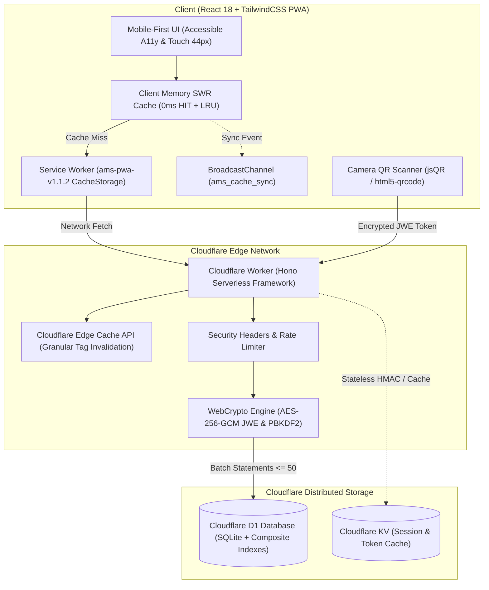

# AMS — Attendance Management System

<div align="center">


-6E9F18?style=for-the-badge&logo=vitest)

**Sistem Manajemen Presensi & Kegiatan Modern Berbasis QR Code Terenkripsi AES-256-GCM JWE untuk Komunitas Komputer (Computer Community).**

[Fitur Utama](#fitur-utama) • [Arsitektur Sistem](#arsitektur-sistem) • [Skema Database & Migrasi](#skema-database--migrasi) • [Panduan Instalasi Lokal](#panduan-instalasi-lokal) • [Panduan Deployment Cloudflare](#panduan-deployment-ke-cloudflare) • [Keamanan & Hardening](#keamanan--hardening-sistem) • [Pengujian](#pengujian-unit--integrasi)

</div>

---

## Tentang AMS

**AMS (Attendance Management System)** adalah platform pencatatan dan pengelolaan presensi berskala *enterprise* yang dirancang khusus untuk kegiatan, seminar, *workshop*, dan keanggotaan organisasi. Dibangun di atas infrastruktur serverless **Cloudflare Workers**, database **Cloudflare D1 (SQLite)**, dan **Cloudflare KV**, AMS memberikan kecepatan respon instan (*edge computing*), efisiensi biaya tinggi (*Zero Cold Start*), kemampuan instalasi mandiri (*Progressive Web App*), serta keamanan kriptografis standar industri.

---

## Fitur Utama

### 1. Impor Tamu Lintas Kegiatan & QR Reusability
- **Penggunaan Ulang Kode QR (Zero Re-print):** Mengimpor peserta tamu dari kegiatan terdahulu ke kegiatan baru tanpa mengharuskan pencetakan ulang atau penerbitan kartu fisik baru. Kode QR fisik maupun digital yang dimiliki tamu dari kegiatan sebelumnya langsung aktif dan valid di pintu masuk kegiatan baru.
- **Batasan 2 Sumber Lampau:** Secara otomatis menyaring dan hanya menampilkan maksimal 2 kegiatan sebelumnya yang memiliki data tiket tamu guna menjaga antarmuka tetap ringkas dan terfokus.
- **Otorisasi Multi-Kegiatan (`event_guests`):** Menautkan otorisasi peserta tamu ke kegiatan target dengan integritas relasi `UNIQUE(event_id, member_id)`.
- **Pemisahan Semantik Unlink vs Delete:** Penghapusan tiket tamu hasil impor pada kegiatan target hanya mencabut relasi otorisasi kegiatan tersebut tanpa merusak tiket asli di kegiatan sumber.
- **Proteksi D1 Batch Chunking:** Pemrosesan batch impor dipecah per 50 statement untuk menjamin kepatuhan batas Cloudflare D1.

### 2. Progressive Web App (PWA) & Offline Shell
- **Instalasi Multi-Platform:** Berjalan sebagai aplikasi mandiri (*standalone*) di Android (WebAPK), iOS Safari (Add to Home Screen), Windows, macOS, dan Linux.
- **Offline Shell & Caching Cerdas:** Service Worker (`sw.js`) mem-precache *App Shell*, aset statis, dan icon resolusi tinggi sehingga aplikasi tetap dapat dibuka dan dioperasikan meski tanpa koneksi internet.
- **Sinkronisasi Lintas-Domain Otomatis:** Mutasi data pada domain kegiatan atau tiket otomatis memicu pembersihan cache `agenda`, `events`, `attendances`, `members`, `reports`, dan `qr` di CacheStorage.
- **Adaptive Maskable Icons & App Shortcuts:** Mendukung adaptive icon Android 13+ serta 4 pintasan cepat dari launcher: *Scan QR*, *Daftar Anggota*, *Kegiatan*, dan *Keaktifan*.
- **Auto-Update Notifier:** Otomatis mendeteksi rilis Service Worker baru (`ams-pwa-v1.1.2`) dan menyajikan notifikasi pembaruan instan (*one-click reload*).

### 3. Pemindai QR Cepat & Multi-Station
- Mendukung pemindaian langsung dari kamera *smartphone*, tablet, maupun webcam laptop.
- Pengenalan QR instan dengan audio chime, haptic feedback, dan live scan toast.
- Tipe sesi fleksibel: `CHECKIN`, `CHECKOUT`, `BREAK_OUT`, `BREAK_IN`, hingga akses panggung/sesi khusus.
- Proteksi *double-scan* konkuren dan pencegahan pemalsuan tiket menggunakan dekripsi **AES-256-GCM JWE Compact Token**.

### 4. 3-Tier Caching & Realtime State Synchronization
- **Tier 1 — SWR Client Memory Cache (0ms):** Memuat data tabel anggota, kegiatan, dan leaderboard keaktifan secara instan saat navigasi antar tab dengan mekanisme LRU eviction (maksimal 100 entri).
- **Tier 2 — Service Worker CacheStorage API:** Caching aset statis dan API offline dengan pembersihan cerdas saat terjadi mutasi non-GET.
- **Tier 3 — Cloudflare Edge Cache API (`caches.default`):** Caching global di jaringan CDN Cloudflare dengan granular tag invalidation (`agenda`, `attendance`, `members`).
- **Realtime Cross-Tab Broadcast:** Menggunakan `BroadcastChannel('ams_cache_sync')` untuk menyinkronkan pembaruan cache ke seluruh tab browser yang terbuka secara real-time.

### 5. Tiket Tamu Sementara & Promosi Instan
- Fasilitas penerbitan tiket tamu (*guest pass*) langsung di lokasi kegiatan melalui mode *Daftar Nama* maupun *Nomor Tiket Batch*.
- **Promosi Anggota Resmi:** Mengubah tamu sementara menjadi anggota tetap dalam 1 kali klik dengan seluruh riwayat kehadiran kegiatan pertama langsung tersinkronisasi.
- **Pembersihan Otomatis:** Opsi *cleanup guest members* untuk merapikan database setelah kegiatan selesai tanpa meninggalkan baris yatim (*orphan rows*).

### 6. Dashboard Analitik Interaktif
- **Grafik Donut Interaktif SVG:** Visualisasi persentase dan peringkat Top 10 Kegiatan dengan peserta terbanyak lengkap dengan *inner scroll container*.
- **Grafik Pertumbuhan Anggota Tahunan:** Visualisasi kohort angkatan anggota per tahun dengan filter dinamis anggota aktif/seluruhnya.
- **Navigasi Langsung:** Klik pada bagian donat atau kartu peringkat untuk langsung membuka detail absensi kegiatan terkait.

### 7. Member Activity Tracker & Tiering Dinamis
- Melacak tingkat keaktifan anggota berdasarkan akumulasi presensi kegiatan:
  - Platinum: >= 8 Kehadiran
  - Gold: 5 - 7 Kehadiran
  - Silver: 2 - 4 Kehadiran
  - Bronze: 1 Kehadiran
  - Inactive / New: 0 Kehadiran
- Seluruh tamu otomatis difilter keluar dari leaderboard keaktifan agar data peringkat tetap valid untuk anggota resmi.

### 8. Manajemen Tim & Autentikasi Admin Berbasis QR
- Role-Based Access Control (RBAC): `owner`, `admin`, `operator`, dan `auditor`.
- Pengangkatan admin langsung dari profil anggota aktif.
- **Login Menggunakan QR Anggota:** Operator dapat login ke dashboard sistem hanya dengan memindai QR anggota pribadinya tanpa perlu mengetik password.

### 9. Multi-Select Batch Actions & Cetak ID Badge A4/PDF
- Fitur multi-select pada seluruh daftar data (Anggota, Kegiatan, Absensi).
- Floating Action Bar responsif: Cetak QR massal, ekspor CSV massal, promosi massal, dan hapus massal dalam sekali klik.
- Layout pencetakan A4 ramah cetak untuk mencetak puluhan badge anggota sekaligus.

---

## Arsitektur Sistem


```mermaid
flowchart TD
    subgraph Client["Client (React 18 + TailwindCSS PWA)"]
        UI["Mobile-First UI (Accessible A11y & Touch 44px)"]
        SWR["Client Memory SWR Cache (0ms HIT + LRU)"]
        SW["Service Worker (ams-pwa-v1.1.2 CacheStorage)"]
        BC["BroadcastChannel (ams_cache_sync)"]
        Scanner["Camera QR Scanner (jsQR / html5-qrcode)"]
    end

    subgraph Edge["Cloudflare Edge Network"]
        Worker["Cloudflare Worker (Hono Serverless Framework)"]
        EdgeCache["Cloudflare Edge Cache API (Granular Tag Invalidation)"]
        SecHeaders["Security Headers & Rate Limiter"]
        Crypto["WebCrypto Engine (AES-256-GCM JWE & PBKDF2)"]
    end

    subgraph Storage["Cloudflare Distributed Storage"]
        D1[("Cloudflare D1 Database (SQLite + Composite Indexes)")]
        KV[("Cloudflare KV (Session & Token Cache)")]
    end

    UI --> SWR
    SWR -->|Cache Miss| SW
    SW -->|Network Fetch| Worker
    SWR -.->|Sync Event| BC
    Scanner -->|Encrypted JWE Token| Worker
    Worker --> EdgeCache
    Worker --> SecHeaders
    SecHeaders --> Crypto
    Crypto -->|Batch Statements <= 50| D1
    Worker -.->|Stateless HMAC / Cache| KV
```

---

## Skema Database & Migrasi

Database menggunakan SQLite serverless Cloudflare D1 yang dikelola melalui migrasi terstruktur pada `src/db/migrations`:

| File Migrasi | Deskripsi Skema |
| :--- | :--- |
| `0001_initial.sql` | Tabel inti: `members`, `events`, `qr_tokens`, `attendances`, `admins`, `audit_logs`. |
| `0002_qr_tokens_note.sql` | Kolom catatan tambahan pada tiket QR untuk identifikasi sumber dan keperluan khusus. |
| `0003_events_manual_attendance.sql` | Opsi absensi manual tanpa pemindaian kamera per kegiatan. |
| `0004_event_status_cancelled.sql` | Status pembatalan kegiatan (`cancelled`). |
| `0005_admins_table.sql` | Penataan relasi akun administrator dengan profil anggota. |
| `0006_relational_integrity_and_indexes.sql` | Indeks komposit performa tinggi: `idx_attendances_member_session`, `idx_events_starts_at`, `idx_qr_tokens_member_event`. |
| `0007_event_guests_multi_event.sql` | Tabel relasi `event_guests` untuk otorisasi tamu lintas kegiatan dan penggunaan ulang kode QR. |

---

## Ringkasan API Endpoints

### Autentikasi & Akun
- `POST /api/auth/login` — Login admin via email & password (dilindungi rate limiting dan anti-timing attack).
- `POST /api/auth/login-qr` — Login admin instan via pemindaian QR anggota.
- `POST /api/auth/logout` — Pencabutan sesi admin.
- `GET /api/auth/me` — Informasi profil admin yang sedang aktif.

### Agenda & Kegiatan
- `GET /api/agenda` — Daftar seluruh kegiatan (mendukung filter status, tanggal, dan pagination).
- `POST /api/agenda` — Pembuatan kegiatan baru.
- `GET /api/agenda/:id` — Detail kegiatan dan statistik presensi.
- `PUT /api/agenda/:id` — Pembaruan konfigurasi kegiatan.
- `DELETE /api/agenda/:id` — Penghapusan kegiatan dengan cascade cleanup manual pada D1.
- `GET /api/agenda/:id/guest-sources` — Mengambil maksimal 2 kegiatan sebelumnya yang memiliki data peserta tamu.
- `GET /api/agenda/:id/guest-candidates` — Daftar kandidat tamu dari kegiatan sumber terpilih beserta status import.
- `POST /api/agenda/:id/guests/import` — Mengimpor tamu terpilih ke kegiatan baru tanpa menerbitkan ulang kode QR.
- `POST /api/agenda/:id/guests/batch-names` — Pembuatan tiket tamu massal berdasarkan daftar nama.
- `POST /api/agenda/:id/guests/batch` — Pembuatan tiket tamu massal berdasarkan nomor urut tiket.

### Presensi & Pemindai QR
- `POST /api/scan/verify` — Verifikasi dan pencatatan absensi dari pemindaian token QR terenkripsi.
- `GET /api/attendances/event/:eventId` — Rekap presensi untuk kegiatan tertentu.
- `POST /api/attendances/manual` — Pencatatan presensi manual oleh operator.
- `DELETE /api/attendances/:id` — Pembatalan rekaman absensi.

### Anggota & Tiket QR
- `GET /api/members` — Pencarian dan daftar anggota dengan pagination.
- `POST /api/members` — Pendaftaran anggota baru.
- `GET /api/qr/event/:eventId` — Daftar tiket QR (langsung maupun impor) untuk kegiatan terkait.
- `POST /api/qr/:id/revoke` — Pencabutan tiket QR.
- `DELETE /api/qr/:id` — Penghapusan tiket QR langsung atau unlinking otorisasi tamu impor via parameter `?event_id=...`.

---

## Panduan Instalasi Lokal

### 1. Prasyarat
- [Node.js](https://nodejs.org/) v18 atau lebih baru.
- npm / pnpm / yarn.

### 2. Kloning Repositori & Pasang Dependensi
```bash
git clone https://github.com/VQA-06/AMS.git
cd AMS
npm install
```

### 3. Konfigurasi Environment Lokal
Salin template konfigurasi lokal:
```bash
cp .dev.vars.example .dev.vars
```
Konfigurasikan variabel environment pada `.dev.vars`:
```ini
ENVIRONMENT="development"
QR_ACTIVE_KID="k1"
QR_KEY_K1="dGhpcy1pcy1hLTMyLWJ5dGUtZGV2LWtleS1mb3ItandlISE="
SESSION_SECRET="ams-dev-session-secret-key-32-chars-long"
APP_ISSUER="https://absen.local"
APP_AUDIENCE="ams"
DEV_ADMIN_EMAIL="admin@absen.local"
```

### 4. Inisialisasi Database Lokal
Terapkan seluruh migrasi skema database SQLite D1 secara lokal:
```bash
npm run db:migrate:local
```

### 5. Menjalankan Server Pengembangan
Jalankan server backend Cloudflare Worker dan antarmuka client:
```bash
# Terminal 1: Backend Worker (Port 8787)
npm run dev:worker

# Terminal 2: Frontend Vite Client (Port 5173)
npm run dev
```
Buka browser di `http://localhost:5173`. Akun Default Owner otomatis diinisialisasi pada peluncuran pertama.

---

## Panduan Deployment ke Cloudflare

### 1. Autentikasi Cloudflare Wrangler
```bash
npx wrangler login
```
Verifikasi status autentikasi:
```bash
npx wrangler whoami
```

### 2. Konfigurasi Cloudflare KV
```bash
npx wrangler kv namespace create KV
```
Perbarui blok `[[kv_namespaces]]` pada `wrangler.toml` sesuai ID yang dihasilkan:
```toml
[[kv_namespaces]]
binding = "KV"
id = "paste-kv-namespace-id-anda-disini"
```

### 3. Konfigurasi Database Cloudflare D1
```bash
npx wrangler d1 create ams-db
```
Perbarui konfigurasi D1 di `wrangler.toml`:
```toml
[[d1_databases]]
binding = "DB"
database_name = "ams-db"
database_id = "paste-database-id-anda-disini"
migrations_dir = "src/db/migrations"
```

Terapkan seluruh migrasi ke database remote:
```bash
npm run db:migrate:remote
```

### 4. Konfigurasi Secrets Kriptografis Produksi
```bash
# Kunci Enkripsi JWE AES-256-GCM (32-byte base64 string)
npx wrangler secret put QR_KEY_K1

# Kunci Secret Token Sesi Admin HMAC-SHA256 (Minimal 32 Karakter)
npx wrangler secret put SESSION_SECRET
```

### 5. Kompilasi & Deployment
Lakukan deployment terintegrasi (kompilasi frontend Vite dan publikasi Cloudflare Worker):
```bash
npm run deploy
```

Untuk menguji konfigurasi tanpa mempublikasikan:
```bash
npx wrangler deploy --dry-run
```

Aplikasi aktif dan dapat diakses melalui custom domain resmi: `https://ams.ccunbaja.web.id`.

---

## Keamanan & Hardening Sistem

1. **Enkripsi JWE AES-256-GCM:** Tiket QR dienkripsi menggunakan WebCrypto API standar industri dengan rotasi Key ID (`kid: k1`). Payload tidak dapat dimanipulasi atau dibaca tanpa kunci privat server.
2. **Perlindungan CSV Formula Injection (CWE-1236):** Sanitasi otomatis (`sanitizeCsvCell`) pada seluruh fitur ekspor guna menetralkan karakter berbahaya (`=`, `+`, `-`, `@`, `\t`, `\r`) saat dibuka di Microsoft Excel atau Google Sheets.
3. **Security Headers Lengkap:** Injeksi otomatis `X-Content-Type-Options: nosniff`, `X-Frame-Options: DENY`, `Referrer-Policy: strict-origin-when-cross-origin`, dan `Permissions-Policy: camera=(self)`.
4. **Anti-Timing Attack:** Menggunakan perbandingan string waktu konstan (`timingSafeEqualStrings`) untuk seluruh verifikasi hash kata sandi dan token otentikasi.
5. **Anti-Brute Force Rate Limiting:** Pembatasan percobaan login berbasis *in-memory sliding window* tanpa membebani kuota I/O database.
6. **Integritas Relasional Manual Cascade D1:** Karena Cloudflare D1 menonaktifkan foreign key cascade secara default antar request worker, seluruh operasi penghapusan kegiatan atau anggota mengeksekusi batch statement pembersihan bertingkat untuk mencegah baris yatim (*orphan rows*).
7. **Zero Cross-Request I/O Overhead:** Edge cache menyimpan payload serializable murni, mencegah error *stream lock* pada runtime V8 Cloudflare Workers.

---

## Pengujian Unit & Integrasi

Seluruh fungsi kriptografi, repository database, skema validasi, caching engine, dan antarmuka routing diuji menggunakan **Vitest**:

```bash
npm test
```

Hasil pengujian otomatis:
```text
 Test Files  20 passed (20)
      Tests  120 passed (120)
   Duration  1.88s
```

Kompilasi statis TypeScript:
```bash
npx tsc --noEmit
```
Hasil: `Exit code 0` (0 error tipe data di seluruh backend dan frontend).

---

## Lisensi & Kontribusi

Dikembangkan dengan bangga untuk **Computer Community**. Dilisensikan di bawah [MIT License](LICENSE).
