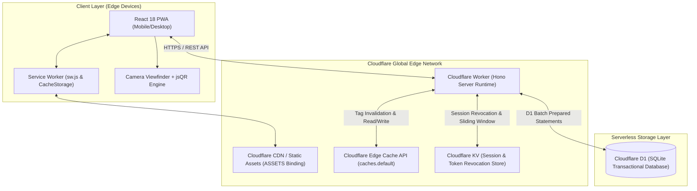
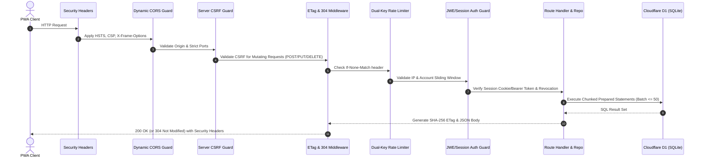
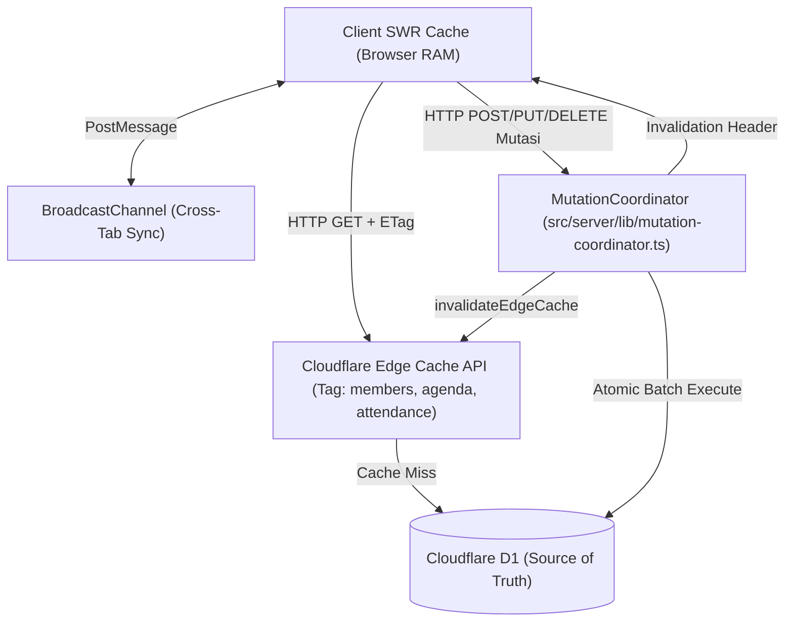
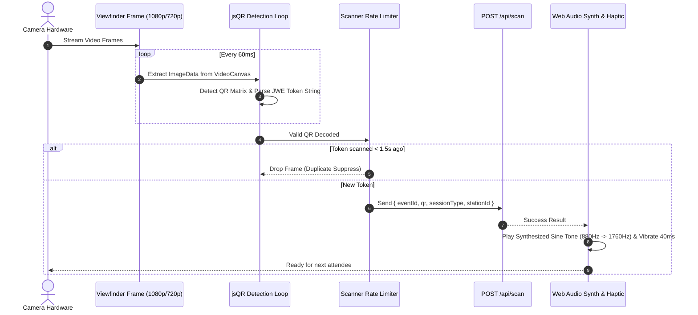

# AMS Architecture & System Design Manual

Sistem Manajemen Presensi Terpadu (**AMS**) dirancang menggunakan arsitektur *edge-native serverless* modern yang beroperasi di atas infrastruktur **Cloudflare Workers**. Arsitektur ini menggabungkan komputasi terdistribusi global berlatensi rendah, basis data transaksional SQLite terkelola (**Cloudflare D1**), *key-value cache* terdistribusi (**Cloudflare KV**), dan aplikasi klien **Progressive Web App (PWA)** berbasis React 18 yang mampu bekerja secara *offline-first*.

Dokumen ini memberikan panduan mendalam mengenai topologi sistem, siklus hidup *request*, subsistem kriptografi, strategi *caching*, *state synchronization*, serta mekanisme pemindaian QR berkecepatan tinggi.

---

## 1. Topologi Sistem & Infrastruktur Global

Infrastruktur AMS memanfaatkan ekosistem Cloudflare secara menyeluruh untuk menjamin ketersediaan tinggi (*high availability*), latensi global sub-50ms, dan *zero cold-start*:



### Komponen Infrastruktur

1. **Cloudflare Worker (Hono Runtime)**: Menjalankan logika *backend* RESTful API, validasi skema Zod, *middleware security*, dan orkestrasi transaksi D1.
2. **Cloudflare D1 (SQLite Database)**: Menyimpan entitas data relasional inti (`members`, `events`, `attendances`, `admins`, `qr_tokens`, `event_guests`, `audit_logs`).
3. **Cloudflare KV (`AMS_KV`)**: Berfungsi sebagai penyimpanan *distributed state* latensi rendah untuk *session revocation*, daftar pembatalan *token* QR (*token blocklist*), dan *rate limit tracking*.
4. **Cloudflare ASSETS (`c.env.ASSETS`)**: Melayani *bundle* statis PWA (HTML, JavaScript, CSS, Web Manifest, Audio FX, Icons) dengan *Cache-Control immutable* (1 tahun) dan `sw.js` *no-cache*.
5. **Client PWA (React 18 + Tailwind CSS)**: Menggunakan arsitektur *dual-ground* (Paper vs Dark Chrome), SWR (*Stale-While-Revalidate*), dan *engine* pemindai kamera berbasis Web Workers / `jsQR`.

---

## 2. Serverless Request Lifecycle & Middleware Pipeline

Setiap permintaan HTTP yang masuk ke *backend* melewati rantai *middleware* terurut pada `src/server/index.ts` sebelum mencapai *route handler* dan *repository layer*:



### Rincian Lapisan Middleware

#### 1. Security Headers (`src/server/middleware/security-headers.ts`)
Setiap respon HTTP disisipi *header* kepatuhan keamanan standar OWASP:
- `Strict-Transport-Security`: `max-age=31536000; includeSubDomains; preload`
- `X-Content-Type-Options`: `nosniff`
- `X-Frame-Options`: `DENY` (Mencegah *Clickjacking*)
- `X-XSS-Protection`: `0` (Modern standard menonaktifkan *legacy buggy filters*)
- `Referrer-Policy`: `strict-origin-when-cross-origin`
- `Permissions-Policy`: `camera=(self), microphone=(), geolocation=(), payment=()`
- `Content-Security-Policy`: Menetapkan batas ketat untuk `default-src 'self'`, `img-src 'self' data: blob:`, `connect-src 'self' https://*`, dan melarang `frame-ancestors 'none'`.

#### 2. Dynamic CORS Guard (`src/server/lib/cors-origin.ts`)
- Membatasi akses *cross-origin* hanya ke *origin* terverifikasi.
- Lingkungan pengembangan mendukung port lokal ketat: `5173` (Vite dev), `8787` (Wrangler dev), `5175` (HTTP preview), `4173` (Vite preview), `3000`.
- Lingkungan produksi membaca `c.env.APP_ISSUER` dan menolak *origin* liar tanpa izin.

#### 3. Anti-CSRF Guard (`src/server/index.ts`)
- Mencegah serangan *Cross-Site Request Forgery* pada *endpoint* mutasi (`POST`, `PUT`, `PATCH`, `DELETE`).
- Memvalidasi *header* `X-Requested-With`, `Sec-Fetch-Site`, atau mencocokkan *token* `X-CSRF-Token` dengan *session cookie* `SameSite=Lax`.

#### 4. ETag & Conditional Requests (`src/server/middleware/etag.ts`)
- Menghasilkan *digest* ETag (SHA-256 ringkas) untuk setiap respon JSON.
- Jika *header* permintaan menyertakan `If-None-Match: <etag>`, *server* langsung mengembalikan status `304 Not Modified` tanpa mengirim ulang *payload*, menghemat *bandwidth* hingga 90%.

#### 5. Dual-Key Sliding Window Rate Limiter (`src/server/middleware/rate-limiter.ts`)
- Mencegah serangan *brute-force* dan DDoS menggunakan algoritma *sliding window counter* dalam memori Worker dan Cloudflare KV.
- Mengombinasikan dua kunci: `IP Address` + `Target Identifier/Account`.
- Batasan ketat pada rute autentikasi (`/api/auth/login`, `/api/auth/login-qr`): maksimal 10 percobaan per jendela 15 menit.

#### 6. JWE & Session Authentication Guard (`src/server/middleware/auth.ts`)
- Memvalidasi *session token* dari *cookie* `absen_session` atau *header* `Authorization: Bearer <token>`.
- Mengecek status *revocation* pada *in-memory cache* dan Cloudflare KV (`revokeSessionToken`).
- Menyediakan *guard* peran RBAC terperinci (`requireRole(['owner', 'admin', 'operator', 'auditor'])`).

#### 7. Global Error Sanitization (`src/server/middleware/error-handler.ts`)
- Menangkap semua pengecualian yang tidak tertangani (*unhandled exceptions*).
- Menyamarkan pesan *database internal* (SQLite constraint error) agar tidak membocorkan struktur tabel atau kunci privat ke publik.
- Mengembalikan format amplop standar `ApiResponse`: `{ ok: false, error: { code: string, message: string } }`.

---

## 3. Subsistem Kriptografi & Manajemen Kunci

Keamanan autentikasi dan tiket digital AMS bergantung pada standar kriptografi modern berbasis **Web Crypto API**:

```
+---------------------------------------------------------------------------------+
|                              SUBSISTEM KRIPTOGRAFI                              |
+---------------------------------------------------------------------------------+
| 1. QR Pass Tokens (JWE - RFC 7516):                                             |
|    - Algoritma Enkripsi: AES-256-GCM (A256GCM)                                  |
|    - Key Derivation: PBKDF2 (SHA-256, 100k iterasi) atau 32-byte direct key     |
|    - Format: <Protected_Header>.<Encrypted_Key>.<IV>.<Ciphertext>.<Auth_Tag>   |
|                                                                                 |
| 2. Credential Hashing (Password PBKDF2):                                        |
|    - Algoritma: PBKDF2-HMAC-SHA256                                              |
|    - Iterasi: 100,000 iterasi standar NIST SP 800-132                           |
|    - Garam (Salt): 16 bytes kriptografis acak (crypto.getRandomValues)          |
|    - Format DB: pbkdf2_sha256$100000$<salt_hex>$<derived_key_hex>               |
|                                                                                 |
| 3. Session Authentication Tokens:                                               |
|    - Format: Signed HMAC-SHA256 Compact Session Token                           |
|    - Payload: { id, email, role, exp, iat, jti }                                |
|    - Proteksi Komparasi: Constant-Time Comparison (timing-safe.ts)              |
+---------------------------------------------------------------------------------+
```

### JWE QR Token Structure (AES-256-GCM)

Setiap kode QR (baik *Universal Member Pass* maupun *Event-Scoped Pass*) dienkripsi penuh menggunakan **JSON Web Encryption (JWE)**:

```json
{
  "protected": "eyBhbGciOiAiZGlyIiwgImVuYyI6ICJBMjU2R0NNIiwgImtpZCI6ICJrMSIgfQ",
  "payload": {
    "sub": "mem_01hqz8x...",
    "jti": "jti_a1b2c3d4...",
    "scope": "universal",
    "iat": 1708000000,
    "nbf": 1708000000,
    "exp": 4102444799,
    "iss": "https://ams.ccunbaja.web.id",
    "aud": "ams"
  }
}
```

- **Integritas & Kerahasiaan**: Data identitas anggota dalam QR tidak dapat dibaca maupun dipalsukan oleh pihak ketiga tanpa `JWE_SECRET`.
- **Mitigasi Serangan Timing**: Fungsi `verifyPassword`, `verifySessionToken`, dan perbandingan *digest* menggunakan fungsi komparasi konstan waktu (`timingSafeEqual`) pada `src/server/crypto/timing-safe.ts`.
- **Rotasi Kunci Dinamis**: Header JWE menyertakan `kid` (Key ID, misal `k1`, `k2`) yang memungkinkan pergantian `JWE_SECRET` tanpa membatalkan token yang telah diterbitkan sebelumnya.

---

## 4. Strategi Caching, Invalidation & State Synchronization

Untuk memastikan waktu respon berada di bawah 10ms tanpa menampilkan data usang (*stale data*), AMS menerapkan koordinasi *cache multi-tier*:



### 1. Cloudflare Edge Cache API (`src/server/lib/edge-cache.ts`)
- *Endpoint* yang aman untuk dibaca (`GET /api/members/divisions`, `GET /api/events`, `GET /api/members/stats/summary`) dibungkus oleh *middleware* `edgeCache`.
- Respon disimpan pada `caches.default` Cloudflare dengan *tag* tertentu (`members`, `agenda`, `attendance`).

### 2. Atomic Cache Invalidation via `MutationCoordinator`
- Setiap operasi mutasi (tambah anggota, konversi tamu, tutup kegiatan, rekam presensi) mengeksekusi *invalidation* terhadap *tag* terkait melalui `MutationCoordinator`.
- Memastikan pembaruan data langsung terlihat secara konsisten di seluruh dunia dalam hitungan milidetik.

### 3. Client SWR & BroadcastChannel Coordination
- Antarmuka pengguna (UI) mengimplementasikan pustaka SWR kustom.
- Ketika aksi mutasi (misal: *Induct Candidate* atau *Delete Attendance*) selesai pada satu *tab*, perubahan dipancarkan melalui `BroadcastChannel('ams_cache_sync')` ke seluruh *tab* lain yang terbuka pada perangkat yang sama tanpa memerlukan koneksi WebSocket yang mahal.

---

## 5. D1 SQLite Database Constraints & Query Optimization

Cloudflare D1 memiliki batasan operasional serverless tertentu yang diakomodasi oleh arsitektur *backend*:

1. **Parameter Chunking (`src/server/lib/d1-utils.ts`)**:
   - D1 membatasi jumlah variabel *binding* maksimal 100 per kueri.
   - Fungsi `chunkArray(ids, D1_MAX_SAFE_PARAM_CHUNK)` memecah kueri `IN (...)` menjadi blok maksimal 50 parameter per *batch statement*.
2. **Atomic Batch Execution**:
   - Operasi yang melibatkan banyak baris (misal *bulk delete* atau *attendance recording*) menggunakan `db.batch([stmt1, stmt2, ...])` untuk memastikan eksekusi atomik dalam satu *round-trip*.
3. **Composite Indexing**:
   - Menempatkan indeks majemuk pada pola akses tersering:
     - `idx_attendances_member_session` (`member_id`, `event_id`, `session_type`)
     - `idx_events_starts_at` (`starts_at DESC`)
     - `idx_qr_tokens_member_event` (`member_id`, `event_id`)
     - `idx_event_guests_token` (`token_id`)
     - `idx_audit_logs_created_at` (`created_at DESC`)

---

## 6. Client PWA & High-Speed Scanner Engine

Modul pemindai presensi (`src/client/pages/ScannerPage.tsx` & `src/server/domain/attendance/attendance-engine.ts`) dirancang untuk pemindaian massal berkecocokan tinggi (*high-throughput event check-in*):



### Fitur Kunci Scanner Engine

1. **Dual Scanning Rate Limiting**:
   - *Client-side debounce*: Mencegah pengiriman *frame* kamera berulang untuk *token* yang sama dalam jendela 1.5 detik.
   - *Server-side rate limit*: `60 requests / 60 seconds` per stasiun pemindai.
2. **Zero External Assets for Feedback**:
   - Audio konfirmasi presensi menggunakan **Web Audio API** berbasis osilator frekuensi parametrik (nada sinus harmonik 880Hz – 1760Hz), menjamin bunyi sukses terdengar instan tanpa perlu memuat file `.mp3` eksternal.
   - Respon fisik menggunakan **Navigator Vibration API** (`navigator.vibrate([40])`).
3. **Grace Period & Multi-Session Verification**:
   - `attendance-engine.ts` memverifikasi status kegiatan (`active`), jendela toleransi waktu (`grace_minutes`), jenis sesi (`CHECKIN`, `CHECKOUT`, `BREAK_OUT`, `BREAK_IN`), dan mencegah duplikasi presensi ganda pada sesi yang sama.
