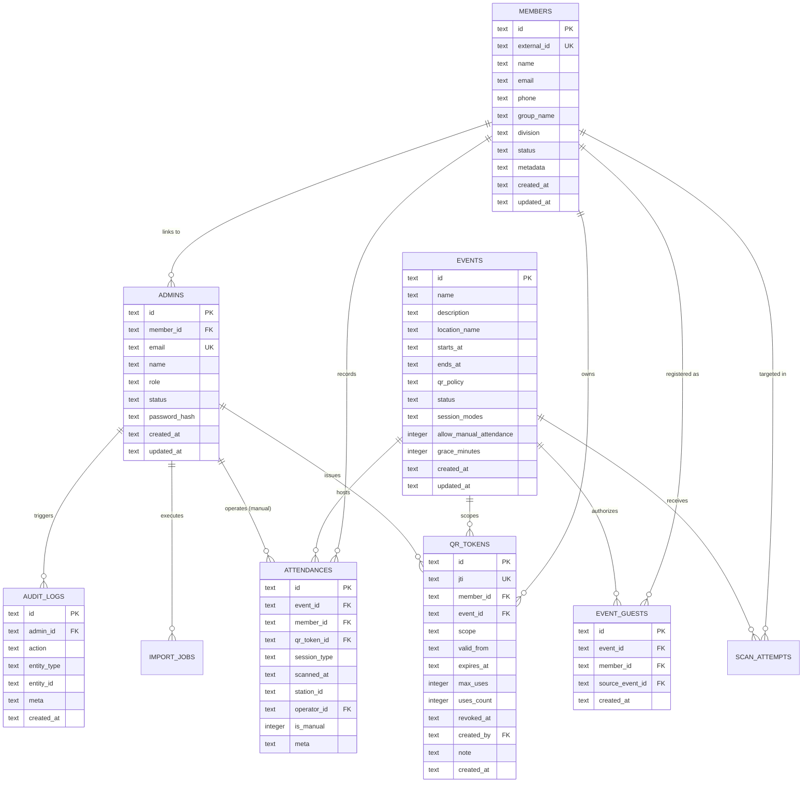

# AMS Database Architecture & Migration Guide

Dokumentasi teknis pemodelan basis data relasional (**Cloudflare D1 SQLite**) untuk Sistem Manajemen Presensi Terpadu (**AMS**).

---

## 1. Topologi & Karakteristik Cloudflare D1

AMS menggunakan **Cloudflare D1**, basis data relasional terkelola (*serverless SQLite*) yang terdistribusi pada jaringan komputasi *edge* global Cloudflare. Karakteristik operasional utama:

1. **ACID Transactional Support**: Menjamin konsistensi data presensi, pembuatan token, dan perubahan status anggota.
2. **Read Replication & Global Low Latency**: Kueri pembacaan data dilayani dalam waktu sub-10ms langsung dari node *edge* terdekat.
3. **Prepared Statements & Parameter Chunking**: Batasan *binding* variabel SQLite diakomodasi melalui fragmentasi kueri maksimal 50 parameter per *statement* (`D1_MAX_SAFE_PARAM_CHUNK`).

---

## 2. Diagram Relasi Entitas (Entity-Relationship Diagram)



---

## 3. Definisi Skema Tabel & Tipe Data

### 3.1. Tabel `members`
Menyimpan seluruh data anggota organisasi, calon anggota (kandidat rekrutmen), anggota terarsip, dan profil tamu undangan.

```sql
CREATE TABLE IF NOT EXISTS members (
  id TEXT PRIMARY KEY,
  external_id TEXT NOT NULL UNIQUE,
  name TEXT NOT NULL,
  email TEXT,
  phone TEXT,
  group_name TEXT,
  division TEXT,
  status TEXT NOT NULL DEFAULT 'active' CHECK(status IN ('active','inactive','candidate','archived')),
  metadata TEXT NOT NULL DEFAULT '{}',
  created_at TEXT NOT NULL DEFAULT (datetime('now')),
  updated_at TEXT NOT NULL DEFAULT (datetime('now'))
);
```

### 3.2. Tabel `events`
Menyimpan konfigurasi agenda kegiatan, kebijakan QR, dan sesi presensi.

```sql
CREATE TABLE IF NOT EXISTS events (
  id TEXT PRIMARY KEY,
  name TEXT NOT NULL,
  description TEXT,
  location_name TEXT,
  starts_at TEXT,
  ends_at TEXT,
  qr_policy TEXT NOT NULL DEFAULT 'event_only' CHECK(qr_policy IN ('event_only','universal_allowed')),
  status TEXT NOT NULL DEFAULT 'draft' CHECK(status IN ('draft','active','closed','archived')),
  session_modes TEXT NOT NULL DEFAULT '["CHECKIN"]',
  allow_manual_attendance INTEGER NOT NULL DEFAULT 0,
  grace_minutes INTEGER NOT NULL DEFAULT 30,
  created_at TEXT NOT NULL DEFAULT (datetime('now')),
  updated_at TEXT NOT NULL DEFAULT (datetime('now'))
);
```

### 3.3. Tabel `admins`
Menyimpan akun pengelola tim panitia dengan peran RBAC bertingkat.

```sql
CREATE TABLE IF NOT EXISTS admins (
  id TEXT PRIMARY KEY,
  member_id TEXT REFERENCES members(id) ON DELETE SET NULL,
  email TEXT NOT NULL UNIQUE,
  name TEXT NOT NULL,
  role TEXT NOT NULL CHECK(role IN ('owner','admin','operator','auditor')),
  status TEXT NOT NULL DEFAULT 'active' CHECK(status IN ('active','inactive')),
  password_hash TEXT,
  created_at TEXT NOT NULL DEFAULT (datetime('now')),
  updated_at TEXT NOT NULL DEFAULT (datetime('now'))
);
```

### 3.4. Tabel `qr_tokens`
Menyimpan registri metadata token JWE QR Pass (*Universal* maupun *Event-Scoped*).

```sql
CREATE TABLE IF NOT EXISTS qr_tokens (
  id TEXT PRIMARY KEY,
  jti TEXT NOT NULL UNIQUE,
  member_id TEXT NOT NULL REFERENCES members(id) ON DELETE CASCADE,
  event_id TEXT REFERENCES events(id) ON DELETE CASCADE,
  scope TEXT NOT NULL CHECK(scope IN ('universal','event')),
  valid_from TEXT NOT NULL,
  expires_at TEXT NOT NULL,
  max_uses INTEGER,
  uses_count INTEGER NOT NULL DEFAULT 0,
  revoked_at TEXT,
  created_by TEXT REFERENCES admins(id) ON DELETE SET NULL,
  note TEXT,
  created_at TEXT NOT NULL DEFAULT (datetime('now')),
  CHECK (
    (scope = 'event' AND event_id IS NOT NULL)
    OR
    (scope = 'universal' AND event_id IS NULL)
  )
);
```

### 3.5. Tabel `attendances`
Menyimpan transaksi presensi yang berhasil divalidasi oleh sistem pemindai atau dicatat secara manual.

```sql
CREATE TABLE IF NOT EXISTS attendances (
  id TEXT PRIMARY KEY,
  event_id TEXT NOT NULL REFERENCES events(id) ON DELETE CASCADE,
  member_id TEXT NOT NULL REFERENCES members(id) ON DELETE CASCADE,
  qr_token_id TEXT NOT NULL REFERENCES qr_tokens(id) ON DELETE CASCADE,
  session_type TEXT NOT NULL DEFAULT 'CHECKIN',
  scanned_at TEXT NOT NULL DEFAULT (datetime('now')),
  station_id TEXT,
  operator_id TEXT REFERENCES admins(id) ON DELETE SET NULL,
  is_manual INTEGER NOT NULL DEFAULT 0,
  meta TEXT NOT NULL DEFAULT '{}'
);
```

### 3.6. Tabel `event_guests`
Mendukung otorisasi tamu lintas kegiatan (*Multi-Event Guest Authorization*).

```sql
CREATE TABLE IF NOT EXISTS event_guests (
  id TEXT PRIMARY KEY,
  event_id TEXT NOT NULL REFERENCES events(id) ON DELETE CASCADE,
  member_id TEXT NOT NULL REFERENCES members(id) ON DELETE CASCADE,
  source_event_id TEXT REFERENCES events(id) ON DELETE SET NULL,
  created_at TEXT NOT NULL DEFAULT (datetime('now')),
  UNIQUE(event_id, member_id)
);
```

### 3.7. Tabel `audit_logs` & `scan_attempts`
Merekam seluruh aktivitas administratif dan jejak pemindaian untuk audit trail kepatuhan.

```sql
CREATE TABLE IF NOT EXISTS audit_logs (
  id TEXT PRIMARY KEY,
  admin_id TEXT REFERENCES admins(id) ON DELETE SET NULL,
  action TEXT NOT NULL,
  entity_type TEXT,
  entity_id TEXT,
  meta TEXT NOT NULL DEFAULT '{}',
  created_at TEXT NOT NULL DEFAULT (datetime('now'))
);

CREATE TABLE IF NOT EXISTS scan_attempts (
  id TEXT PRIMARY KEY,
  event_id TEXT REFERENCES events(id) ON DELETE CASCADE,
  token_jti TEXT,
  member_id TEXT REFERENCES members(id) ON DELETE CASCADE,
  result TEXT NOT NULL CHECK(result IN ('success','failed')),
  reason TEXT,
  station_id TEXT,
  operator_id TEXT REFERENCES admins(id) ON DELETE SET NULL,
  created_at TEXT NOT NULL DEFAULT (datetime('now'))
);
```

---

## 4. Indeks & Optimasi Performa Kueri

Indeks majemuk (*composite indexes*) dipasang secara strategis untuk menjamin efisiensi kueri pemindaian presensi dan pelaporan analitik:

| Nama Indeks | Target Tabel | Kolom | Tujuan Optimasi |
|---|---|---|---|
| `ux_attendance_unique` | `attendances` | `event_id, member_id, session_type` | Mencegah presensi ganda pada sesi yang sama |
| `idx_attendances_member_session` | `attendances` | `member_id, session_type` | Agregasi matriks keaktifan anggota |
| `idx_attendances_event_session` | `attendances` | `event_id, session_type` | Filter daftar presensi per sesi |
| `idx_members_status_division` | `members` | `status, division` | Filter cepat direktori dan pelantikan anggota |
| `idx_events_starts_at` | `events` | `starts_at DESC` | Urutan linimasa agenda kegiatan |
| `idx_qr_tokens_validity` | `qr_tokens` | `revoked_at, expires_at` | Validasi masa berlaku tiket secara instan |
| `idx_event_guests_event` | `event_guests` | `event_id` | Verifikasi hak akses tamu kegiatan |
| `idx_audit_logs_admin` | `audit_logs` | `admin_id` | Penelusuran jejak aktivitas per administrator |

---

## 5. Matriks Riwayat Migrasi Skema (0001 - 0009)

Semua perubahan skema database dikelola melalui file migrasi SQL terurut dalam direktori `src/db/migrations/`:

| Versi | File Migrasi | Deskripsi & Dampak Skema |
|---|---|---|
| **0001** | `0001_initial_schema.sql` | Skema dasar AMS: pembuatan tabel `admins`, `members`, `events`, `qr_tokens`, `attendances`, `scan_attempts`, `import_jobs`, dan `audit_logs`. |
| **0002** | `0002_add_admin_password.sql` | Penambahan kolom `password_hash` pada tabel `admins` untuk mendukung autentikasi berbasis kata sandi lokal. |
| **0003** | `0003_seed_default_owner.sql` | Seeding akun default Master Owner (`adm_owner_default`) untuk bootstrapping instalasi awal sistem. |
| **0004** | `0004_add_admin_member_id.sql` | Penambahan kolom relasi `member_id` pada tabel `admins` untuk integrasi akun panitia dengan kartu identitas anggota. |
| **0005** | `0005_relational_integrity_and_indexes.sql` | Penegakan *foreign key cascade* dan indeks integritas relasional lintas tabel utama. |
| **0006** | `0006_relational_integrity_and_indexes.sql` | Penambahan indeks performa kueri untuk pemindaian massal dan rekapitulasi data. |
| **0007** | `0007_event_guests_multi_event.sql` | Pembuatan tabel `event_guests` untuk mendukung penggunaan ulang tiket tamu lintas kegiatan (*Multi-Event Guest Passes*). |
| **0008** | `0008_candidate_lifecycle_and_status.sql` | Pengenalan status siklus hidup kandidat (`candidate`, `archived`) dan indeks komposit status-divisi. |
| **0009** | `0009_expand_member_status_check_constraint.sql` | Pembangunan ulang tabel `members` menggunakan migrasi SQLite atomik untuk memperluas `CHECK (status IN ('active', 'inactive', 'candidate', 'archived'))` secara permanen. |

---

## 6. Prosedur Eksekusi Migrasi D1

### Eksekusi Lokal (Development):
```bash
npx wrangler d1 migrations apply AMS_DB --local
```

### Eksekusi Produksi (Cloudflare Remote):
```bash
npx wrangler d1 migrations apply AMS_DB --remote
```
