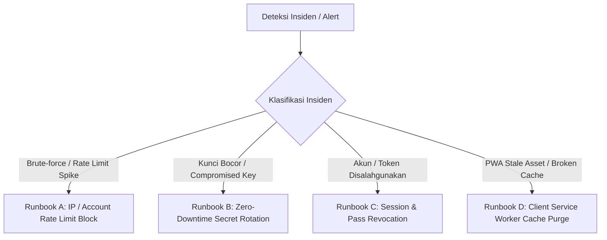

# AMS Operations, Deployment & Incident Response Runbook

Panduan operasional produksi (**DevOps Runbook**), prosedur *deployment*, manajemen *secret*, pemantauan sistem, dan penanganan insiden (**Incident Response**) untuk Sistem Manajemen Presensi Terpadu (**AMS**).

---

## 1. Prasyarat & Perangkat Kerja (Prerequisites)

Untuk mengelola, men-*deploy*, dan memelihara AMS pada infrastruktur Cloudflare, pastikan Anda memiliki perangkat kerja berikut:

- **Node.js**: Versi `20.x` LTS atau lebih baru.
- **Package Manager**: `npm` (v10+).
- **Wrangler CLI**: `wrangler` (v3.80+ / terinstal lokal melalui devDependencies).
- **Akun Cloudflare**: Memiliki hak akses untuk membuat Worker, D1 Database, dan KV Namespace.
- **OpenSSL**: Untuk membangkitkan kunci kriptografi berkekuatan tinggi (AES-256 / HMAC-SHA256).

Verifikasi instalasi lokal:
```bash
node -v
npm -v
npx wrangler --version
```

---

## 2. Matriks Konfigurasi Variabel Lingkungan (Environment Matrix)

Berikut adalah kamus lengkap variabel lingkungan (*environment variables*) dan *secret* yang digunakan oleh runtime serverless Cloudflare Workers:

| Nama Variabel / Binding | Tipe | Sensitivitas | Deskripsi & Contoh Nilai |
|---|---|---|---|
| `DB` | D1 Database Binding | Internal | Binding D1 SQLite database (misal: `AMS_DB`). |
| `KV` | KV Namespace Binding | Internal | Binding Cloudflare KV untuk cache sesi & pembatalan token (`AMS_KV`). |
| `ASSETS` | Fetcher Binding | Internal | Binding Cloudflare ASSETS untuk melayani file statis PWA dari `./dist`. |
| `ENVIRONMENT` | String (Public Var) | Publik | Lingkungan runtime: `production` atau `development`. |
| `APP_ISSUER` | String (Public Var) | Publik | FQDN domain aplikasi: `https://ams.ccunbaja.web.id`. |
| `APP_AUDIENCE` | String (Public Var) | Publik | Identifier audience untuk validasi klaim JWE (`ams`). |
| `QR_ACTIVE_KID` | String (Public Var) | Publik | Key ID aktif untuk penandatanganan JWE baru (`k1`, `k2`). |
| `ENABLE_GUEST_CONVERSION` | String (Public Var) | Publik | Flag fitur konversi tamu ke kandidat: `"true"` / `"false"`. |
| `DEV_ADMIN_EMAIL` | String (Public Var) | Publik | Email admin bawaan untuk lingkungan development. |
| `SESSION_SECRET` | String (Secret) | **Sangat Rahasia** | Kunci 32-byte hex untuk menandatangani session token HMAC-SHA256. |
| `QR_KEY_K1` | String (Secret) | **Sangat Rahasia** | Kunci simetris 32-byte hex untuk enkripsi AES-256-GCM JWE (Key `k1`). |
| `QR_KEY_K2` | String (Secret) | **Sangat Rahasia** | Kunci cadangan untuk rotasi JWE tanpa downtime (Key `k2`). |

---

## 3. Panduan Provisioning Infrastruktur Baru (Step-by-Step)

### Langkah 1: Buat D1 Database & KV Namespace
Jalankan perintah Wrangler berikut dari terminal:

```bash
# 1. Buat database D1
npx wrangler d1 create ams-db

# 2. Buat KV Namespace untuk session & token revocation cache
npx wrangler kv:namespace create ams-kv
```

Salin `database_id` dan `id` KV yang dihasilkan terminal ke file `wrangler.toml`.

### Langkah 2: Bangkitkan Kunci Rahasia Kriptografi
Bisa menggunakan OpenSSL untuk membuat kunci acak 32-byte (256-bit):

```bash
# Bangkitkan Session Secret
openssl rand -hex 32

# Bangkitkan JWE Master Key (k1)
openssl rand -hex 32
```

### Langkah 3: Konfigurasi Cloudflare Secrets
Unggah kunci rahasia secara aman ke Cloudflare Workers:

```bash
npx wrangler secret put SESSION_SECRET
# Masukkan nilai hex hasil generate langkah 2

npx wrangler secret put QR_KEY_K1
# Masukkan nilai hex hasil generate langkah 2
```

### Langkah 4: Terapkan Skema Database D1
Terapkan seluruh migrasi (0001 hingga 0009) ke database Cloudflare D1:

```bash
npx wrangler d1 migrations apply ams-db --remote
```

### Langkah 5: Build & Deploy Aplikasi
```bash
# Kompilasi frontend React PWA
npm run build

# Deploy Cloudflare Worker & Static Assets
npx wrangler deploy
```

---

## 4. Manajemen Migrasi & Perubahan Skema Database

### Menambahkan Migrasi Baru
1. Buat file SQL baru dengan format urutan 4 digit di `src/db/migrations/`:
   ```bash
   touch src/db/migrations/0010_nama_fitur_baru.sql
   ```
2. Tulis perintah SQL DDL/DML. Pastikan menggunakan sintaks SQLite murni.
3. Uji coba migrasi pada database lokal:
   ```bash
   npx wrangler d1 migrations apply ams-db --local
   ```
4. Jalankan pengujian otomatis untuk memverifikasi kompatibilitas:
   ```bash
   npx vitest run
   ```
5. Terapkan ke produksi:
   ```bash
   npx wrangler d1 migrations apply ams-db --remote
   ```

---

## 5. Observabilitas, Monitoring & Health Checks

### 1. Real-time Live Log Streaming
Gunakan perintah `tail` untuk memantau log eksekusi Worker, status HTTP, latensi kueri D1, dan pesan kesalahan:

```bash
npx wrangler tail --format pretty
```

Filter log berdasarkan status kode HTTP:
```bash
npx wrangler tail --status error
```

### 2. Automated Health Check Endpoint
Endpoint `/api/health` dapat diintegrasikan dengan alat pemantau uptime (BetterUptime, UptimeRobot, Cloudflare Health Checks):

- **URL**: `https://ams.ccunbaja.web.id/api/health`
- **Metode**: `GET`
- **Ekspektasi Respon (200 OK)**:
```json
{
  "status": "healthy",
  "environment": "production",
  "timestamp": "2025-04-10T10:00:00.000Z"
}
```

---

## 6. Prosedur Tanggap Darurat & Penanganan Insiden (Runbooks)



### Runbook A: Penanganan Blokir Rate Limiter
**Gejala**: Pengguna sah mendapatkan pesan `Terlalu banyak percobaan. Silakan coba lagi dalam 15 menit.` (HTTP 429).
**Penyebab**: Terjadi kegagalan input kata sandi berulang (>10 kali) dari IP atau email yang sama.
**Tindakan**:
1. Tunggu jendela *sliding window* 15 menit berakhir secara alami, ATAU
2. Jika menggunakan Cloudflare KV, hapus kunci rate limiter terkait:
   ```bash
   npx wrangler kv:key delete --binding=KV "auth:ip:<IP_ADDRESS>"
   npx wrangler kv:key delete --binding=KV "auth:account:<EMAIL>"
   ```

### Runbook B: Rotasi Kunci JWE & Session Tanpa Downtime (*Zero-Downtime Key Rotation*)
**Gejala**: Diperlukan rotasi rutin berkala atau kunci JWE lama dicurigai bocor.
**Tindakan**:
1. Bangkitkan kunci baru `k2`:
   ```bash
   openssl rand -hex 32
   ```
2. Tambahkan kunci baru ke Cloudflare Secret:
   ```bash
   npx wrangler secret put QR_KEY_K2
   ```
3. Ubah variabel `QR_ACTIVE_KID` di `wrangler.toml` menjadi `"k2"`.
4. Deploy pembaruan:
   ```bash
   npx wrangler deploy
   ```
5. **Hasil**: Token QR lama bertanda `k1` tetap valid untuk dipindai (karena `QR_KEY_K1` masih ada di secret), sedangkan semua token QR baru yang dibuat akan dienkripsi menggunakan kunci `k2`.
6. Setelah seluruh token lama kedaluwarsa atau diganti, hapus `QR_KEY_K1`.

### Runbook C: Pencabutan Sesi Akun & Pembatalan Tiket QR Instan
**Skenario**: Akun panitia dinonaktifkan atau kartu QR anggota hilang/dicuri.
**Tindakan**:
1. **Untuk Akun Panitia**:
   - Masuk sebagai `owner` -> Buka menu **Pengaturan** -> **Tim Panitia**.
   - Ubah status akun menjadi `inactive` atau hapus akun.
   - Sistem secara otomatis memanggil `revokeAllSessionsForAdmin(email)` yang langsung membatalkan semua *session token* aktif di seluruh perangkat.
2. **Untuk Kartu QR Anggota**:
   - Buka menu **Anggota** / **QR Management**.
   - Klik aksi **Batalkan (Revoke)** pada token yang bersangkutan.
   - Kueri pemindai di `attendance-engine.ts` akan langsung menolak token tersebut (`TOKEN_REVOKED`).

### Runbook D: Pembersihan Cache Service Worker Klien
**Skenario**: Klien masih memuat versi antarmuka lama meskipun server telah diperbarui.
**Tindakan**:
1. Server AMS telah dikonfigurasi dengan *header* `Cache-Control: public, max-age=0, must-revalidate` khusus untuk file `/sw.js`.
2. Pengguna cukup melakukan *pull-to-refresh* atau menutup dan membuka kembali aplikasi PWA.
3. Service Worker akan mendeteksi perbedaan hash *byte-to-byte* dan memicu event `updatefound` yang langsung memperbarui aset `./dist` terbaru.
