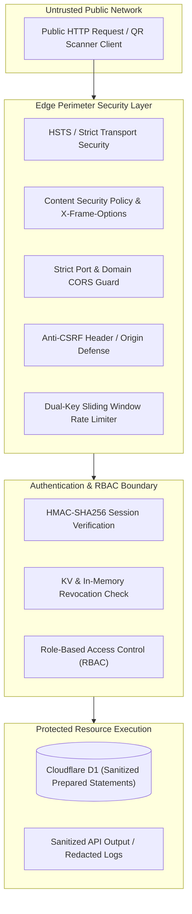

# AMS Security Policy & Vulnerability Remediation Architecture

This document specifies the enterprise security policy, threat model, cryptographic architecture, security controls, and Strix penetration testing remediation matrix for the Attendance Management System (**AMS**) in full compliance with **OWASP Top 10 (2021)** and **CWE (Common Weakness Enumeration)** standards.

---

## 1. Threat Model & Security Boundaries

AMS operates on a zero-trust, edge-native serverless architecture combining Cloudflare Workers (compute), Cloudflare D1 (SQLite relational storage), Cloudflare KV (distributed token revocation cache), and a modern React 18 Progressive Web App (PWA).



### Trust Boundaries & Access Tiers

1. **Public Boundary (Unauthenticated)**:
   - Endpoints: `POST /api/auth/login`, `POST /api/auth/login-qr`, `GET /api/health`.
   - Security Controls: Dual-key rate limiting (IP + Account), constant-time credential checking, JSON-only content type enforcement.
2. **Authenticated Operator Boundary**:
   - Endpoints: `POST /api/scan`, `POST /api/attendances/event/:id/manual`, `GET /api/events`.
   - Security Controls: Session token integrity, station-level scan rate limiter, event status gating.
3. **Admin & Owner Privilege Boundary**:
   - Endpoints: `/api/members/*`, `/api/events/*`, `/api/qr/*`, `/api/auth/admins/*`.
   - Security Controls: Strict role enforcement, default owner delete protection, atomic audit trail logging.
4. **Auditor Compliance Boundary**:
   - Endpoints: `GET /api/audit/logs`, `GET /api/members/export`, `GET /api/attendances/export`.
   - Security Controls: Read-only access, automated email address masking (`bu***@ccunbaja.web.id`), CSV formula injection sanitization.

---

## 2. Strix Penetration Test Vulnerability Remediation Matrix

The following matrix documents the complete resolution of all 17 security findings identified during formal repository vulnerability scanning and penetration testing:

| Vulnerability ID | Classification (CWE / OWASP) | Vulnerability Description | Root Cause | Remediated Implementation |
|---|---|---|---|---|
| **vuln-0001** | CWE-307 / A07:2021 (Brute Force) | Rate limiting bypass via IP rotation | Rate limiter keyed solely on client IP address | Multi-key rate limiter tracking both IP (`auth:ip:${ip}`) and account email (`auth:account:${email}`) with 10 failed attempts lockout per 15-minute window |
| **vuln-0002** | CWE-916 / A02:2021 (Cryptographic Failures) | Sub-optimal PBKDF2 iteration count | Default iteration count below current guidance | Upgraded default PBKDF2 iterations to 100,000 (SHA-256, maximum supported by Cloudflare Workers edge runtime) with backward-compatible verification and automated transparent upgrade on login |
| **vuln-0003** | CWE-613 / A07:2021 (Insufficient Session Expiration) | Session token remains usable after logout | Stateless tokens lacked explicit revocation tracking | Server-side token revocation registry (`revokeSessionToken`, `isSessionTokenRevoked`) checked on every authenticated request |
| **vuln-0004** | CWE-306 / A07:2021 (Missing Authentication for Sensitive Function) | Email change without re-authentication | `PATCH /api/auth/profile` permitted email modification without password verification | Enforced mandatory `current_password` verification before executing email modifications |
| **vuln-0005** | CWE-942 / A05:2021 (Security Misconfiguration) | Overly permissive local CORS origin matching | Origin check allowed arbitrary unconfigured localhost ports | Strict port whitelist (`5173`, `8787`, `5175`, `4173`, `3000`) and explicitly configured `ALLOWED_ORIGINS` |
| **vuln-0006** | CWE-285 / A01:2021 (Broken Access Control) | Unauthorized access to member universal QR tokens | Missing role gating and self-ownership checks on QR endpoints | Enforced `requireRole(['owner', 'admin'])` on bulk endpoints and self-ownership (`admin.member_id === id`) on single member QR |
| **vuln-0007** | CWE-287 / A07:2021 (Identification and Authentication Failures) | Insufficient validation on QR login passes | QR token revocation and active admin status were unverified in legacy QR auth | Cryptographic signature verification, JTI database revocation check, and active linked admin verification with `LOGIN_QR` audit logging |
| **vuln-0008** | CWE-204 / A07:2021 (Observable Response Discrepancy) | Account enumeration via distinct error messages | Login endpoint returned distinct error messages for invalid email vs wrong password | Unified constant-time response returning 401 with `Email atau password salah.` and executed dummy password hashing for non-existent users |
| **vuln-0009** | CWE-440 / A04:2021 (Inconsistent Data Reporting) | Discrepancy between requested and actual deleted attendances | API returned requested ID count rather than database affected rows | Extracted actual changes count from D1 mutation result `meta.changes` for audit logging and client response |
| **vuln-0010** | CWE-754 / A04:2021 (Improper Check for Unusual or Exceptional Conditions) | Malformed JSON in SQLite metadata query exception | Direct `json_extract` calls without schema validation could cause SQLite query aborts | Wrapped all JSON extract conditions with `json_valid(metadata) = 1` guards and sanitized backend error handling |
| **vuln-0011** | CWE-352 / A01:2021 (Cross-Site Request Forgery) | Ambient cookie authentication vulnerable to cross-origin mutation | Missing CSRF defense on cookie-based state-changing endpoints | Middleware rejecting cookie-authenticated mutating requests (`POST`, `PUT`, `PATCH`, `DELETE`) with untrusted Origin / Referer |
| **vuln-0012** | CWE-524 / A04:2021 (Information Exposure Through Caching) | Residual sensitive API caches post-logout | Service Worker cached API responses without auth isolation | Excluded `/api/auth/*` from persistent CacheStorage, added `PURGE_AUTH_CACHE` handler, and purged caches on logout in `useAuth` |
| **vuln-0013** | CWE-840 / A04:2021 (Business Logic Errors) | Scanning unconfigured attendance session types | Scan engine did not validate `cmd.sessionType` against event `session_modes` | Validated `cmd.sessionType` against `event.session_modes` in both `recordScan` and `recordManual`, rejecting disabled modes with 400 |
| **vuln-0014** | CWE-613 / A07:2021 (Insufficient Session Expiration on Deactivation) | Deactivated admin sessions remained valid until TTL | Deactivation updated database status without invalidating active session tokens | Added `revokeAllSessionsForAdmin` on admin status change to `inactive`, invalidating token timestamps and admin cache |
| **vuln-0015** | CWE-248 / A04:2021 (Uncaught Exception on Unique Constraint) | Unhandled duplicate member email constraint violation | Missing pre-insert email uniqueness validation in Member routes | Implemented `MemberRepository.findByEmail` with case-insensitive normalization and descriptive 400 validation response |
| **vuln-0016** | CWE-200 / A01:2021 (Exposure of Sensitive Information) | Admin email and member directory disclosure in audit logs | Auditor role received unredacted admin personal email addresses and meta | Implemented `sanitizeAuditLogsForAuditor` masking personal email addresses and sensitive creation metadata |
| **vuln-0017** | CWE-352 / A01:2021 (Login CSRF & Content-Type Bypass) | Login endpoints accepted arbitrary Content-Types | Lack of strict Content-Type validation allowed form-encoded login submissions | Enforced strict `Content-Type: application/json` and origin validation across all authentication endpoints |

---

## 3. Cryptographic Standards & Key Management

### 3.1. Password Hashing (PBKDF2)
- **Algorithm**: `PBKDF2-HMAC-SHA256`
- **Iterations**: `100,000` (NIST SP 800-132 recommendation; ceiling for Cloudflare `workerd` runtime).
- **Salt**: Cryptographically secure 16-byte random salt generated via `crypto.getRandomValues()`.
- **Format in DB**: `pbkdf2_sha256$100000$<salt_hex>$<derived_key_hex>`
- **Transparent Upgrade**: Older passwords (<100,000 iterations) are verified and automatically re-hashed to the modern standard upon successful authentication.

### 3.2. Digital Pass QR Token Encryption (JWE)
- **Standard**: RFC 7516 (JSON Web Encryption).
- **Encryption Algorithm**: `A256GCM` (AES-256 in Galois/Counter Mode).
- **Key Management**: Symmetric direct key (`dir`) with multi-kid rotation (`QR_ACTIVE_KID`).
- **Payload Verification**:
  - Expiration (`exp`) and Not Before (`nbf`) validity windows.
  - Issuer (`iss`) and Audience (`aud`) claims verification.
  - Real-time JTI revocation check in Cloudflare D1.

### 3.3. Session Tokens & Secret Rotation
- **Signature**: HMAC-SHA256 with server-side secret (`SESSION_SECRET`).
- **Timing Defense**: All token comparisons use constant-time byte equality (`timingSafeEqualStrings`).
- **Secret Rotation**:
  1. Generate new 32-byte secret (`openssl rand -hex 32`).
  2. Set in Cloudflare Secret environment variables.
  3. Active sessions gracefully expire within their designated TTL or are instantly revoked via Cloudflare KV.

---

## 4. Privacy & PII Protection (Data Redaction)

1. **Email Masking for Auditor Role**:
   - Addresses like `ketua@organization.org` are automatically sanitized to `ke***@organization.org` in all audit responses.
2. **CSV Formula Injection Sanitization (`src/server/lib/csv-sanitizer.ts`)**:
   - Any cell value starting with `=`, `+`, `-`, `@`, `\t`, or `\r` is escaped with a leading single quote (`'`) to prevent formula execution in Microsoft Excel or Google Sheets.
3. **Database Error Cloaking**:
   - Raw SQLite constraint violations (e.g. `UNIQUE constraint failed`) are intercepted by `errorHandler` and translated into sanitized domain messages.

---

## 5. Security Verification & Continuous Pentesting

Execute the automated penetration test suite:

```bash
npx vitest run tests/strix-pentest-remediation.test.ts
```

Execute full regression security and contrast suites:

```bash
npx vitest run tests/password-crypto.test.ts
npx vitest run tests/text-contrast-guard.test.ts
```
